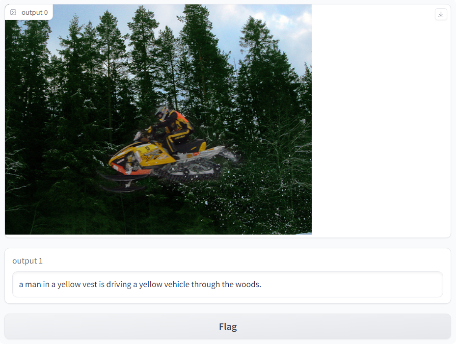
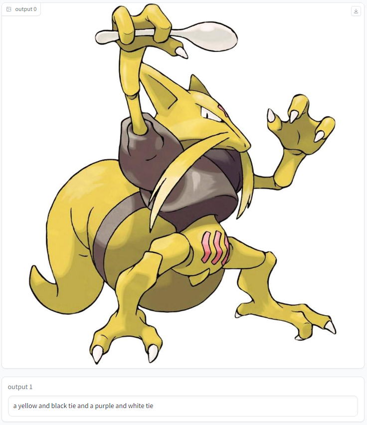

# Image Captioning

## Mô tả dự án

Dự án Image Captioning này sử dụng các bộ dữ liệu Pokemon và Flickr8k để tạo chú thích mô tả cho hình ảnh.

## Demo

Đây là một số hình ảnh minh họa từ dự án:

<div align="center">
    
    
</div>

## Dòng lệnh cơ bản

Sử dụng dòng lệnh sau để chạy dự án:

```bash
python main.py
python main.py --mode=pokemon
python main.py --mode=flickr8k
```

### Mô tả bộ dữ liệu

Pokemon
https://huggingface.co/datasets/lambdalabs/pokemon-blip-captions

Flickr8k
https://www.kaggle.com/datasets/adityajn105/flickr8k

### Benchmark

Độ sai lệch giữa hai câu được đo lường bằng độ đo WER (Word Error Rate).

### Đánh giá

Đang cập nhật.
